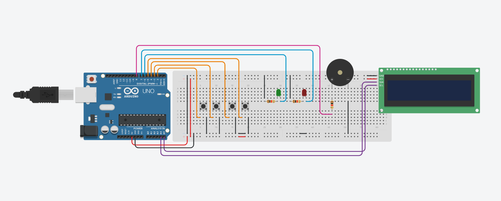

# Loja com Arduino

Projeto de uma loja utilizando Arduino Uno.

## Funcionalidades

- Menu animado
- LCD I2C
- Navegação com botões
- Carrinho de compras
- Sistema de pagamento
- Buzzer
- LEDs de confirmação

## Componentes

- Arduino Uno
- LCD I2C
- Botões
- Buzzer
- LEDs

## Montagem

Foto da montagem do projeto no Tinkercad

[Clique aqui para acessar!](https://www.tinkercad.com/things/3vT7ip07zOy/editel?returnTo=%2Fdashboard%2Fdesigns%2Fall&sharecode=OKl1W23s59wnrVVWOuXGSogNtKWs5cM7XBX5nc_mM90)

## Autores

| Desenvolvedor(a) | Função no projeto           |
| ---------------- | --------------------------- |
| Alberto Kayron   | Função de excluir produto   |
| Dafny Sabino     | Função de ver carrinho      |
| Icaro Pereira    | Função de pagamento         |
| Luna Freitas     | Função de ver produtos      |
| Eduarda Andrade  | Função de adicionar produto |